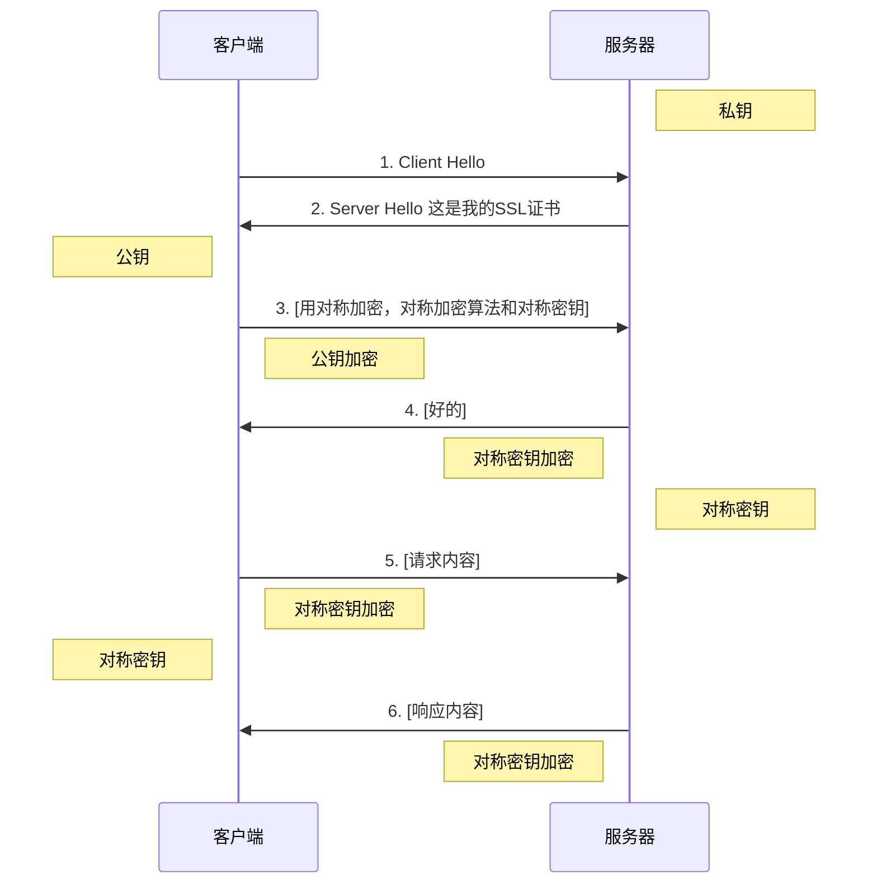

# https原理

# 概念

HTTPS经由HTTP进行通信，但**利用SSL/TLS来加密数据包。**

HTTPS开发的主要目的，是提供**对网站服务器的身份认证，保护交换数据的隐私与完整性。**

HTTP VS HTTPS

| http     | https      |
| -------- | ---------- |
| 信息窃听 | 信息加密   |
| 信息篡改 | 完整性校验 |
| 信息劫持 | 身份验证   |

## 协议

https协议：可以理解为HTTP+SSL/TLS

## 加密算法

1. 对称加密

   加密和解密都是使用的同一个密钥

2. 非对称加密

   加密使用的密钥和解密使用的密钥不同，公钥加密，私钥解密。

   根本上是利用一种单向陷门函数：正向运算容易，反向运算很难。

3. 哈希算法

   获取文本的摘要信息，当做指纹，不可逆

4. 数字签名

   保证信息未被串改过，通常是将信息进行哈希并加密，用做签名，与信息一起传输

## 详解

### http过程

### http风险

1. 容易被窃听
2. 容易被篡改
3. 容易被冒充

## https过程

## 第2步

如上图所示，第2步[^SSL证书] 服务器发送了一个SSL证书给客户端，证书内容有：

1. 证书发布机构

2. 证书有效期

3. 公钥

4. 证书所有者

5. 签名

   …...

## 第3步

第3步中浏览器收到服务器发来SSL证书时，会对证书真伪进行校验：

1. 浏览器读取证书中的证书所有者、有效期等信息进行一一校验
2. 浏览器开始查找[操作系统](http://lib.csdn.net/base/operatingsystem)中已内置的受信任的证书发布机构CA，与服务器发来的证书中的颁发者CA比对，用于校验证书是否为合法机构颁发 
3. 如果找不到，浏览器就会报错，说明服务器发来的证书是不可信任的
4. 如果找到，那么浏览器就会从操作系统中取出 颁发者CA  的公钥，然后对服务器发来的证书里面的签名进行解密
5. 浏览器使用相同的hash算法计算出服务器发来的证书的hash值，将这个计算的hash值与证书中签名做对比
6. 对比结果一致，则证明服务器发来的证书合法，没有被冒充
7. 此时浏览器就可以读取证书中的公钥，用于后续加密了

# 总结

https比http更安全

1. 加密传输。所有信息都是加密传播，黑客无法窃听。
2. 防篡改。 具有校验机制，一旦被篡改，通信双方会立刻发现。
3. 防冒充。配备身份证书，防止身份被冒充。

[^SSL证书]:  SSL证书

> [https原理](https://blog.csdn.net/zhongzh86/article/details/69389967)