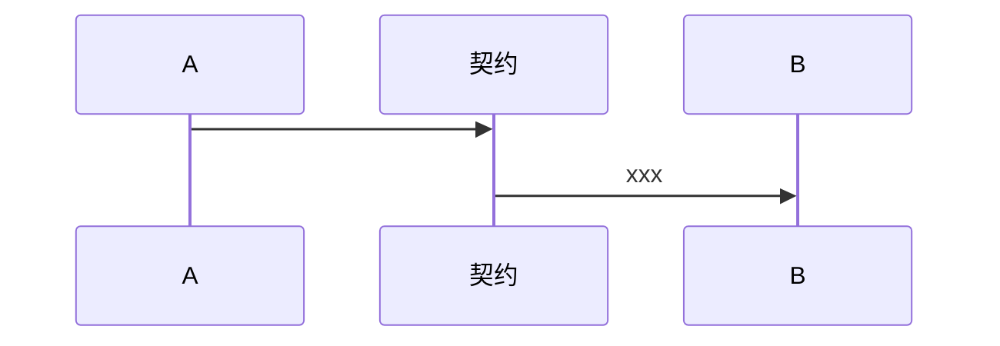

# 通用构件设计

## 约定字段

- configProps
- dataSource
- filelds

lifeCycle -> useResolves ? 什么

Provider 构件？

列表构件 -> 

## 契约

yarn yo 契约

# Routing

1l listen

Render

1. Match a storyboard
2. load dependencies
3. match routes
4. mount bricks

Resolvers 能力

reslolve 先调用接口加载数据，然后加载页面

brick-kit/src/core/Router.ts

Reconciler？

Nested resolves

1. LoadingOnCommand

2. BuildbrickpackagesLoadstoryboards

3. Route

1.1 Match a storyboadrd

1.2 Loading dependencies

brick container server ? nginx  api gateway?

local proxy

